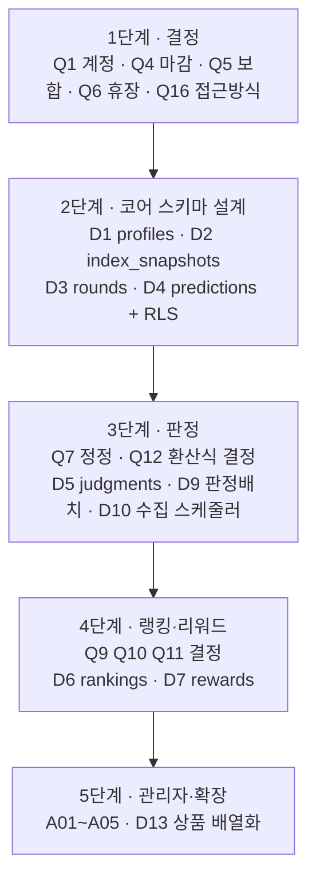

# DB 설계 문서 검토 — Supabase PostgreSQL

작성일 2026-09-21 · 대상 `prototype/wild-bread-market` · 상위 저장소 `sesac-4th-corp-rfp`

이 문서는 **"지금 있는 DB 문서가 앞으로 만들 기능을 감당하는가"** 를 판정하고, 부족한 부분을 ① 설계해야 할 것(엔지니어링)과 ② 사람이 결정해야 할 것(의사결정)으로 나눠 정리한 것이다.
아래 "확인된 사실"은 모두 저장소의 실제 파일에서 확인했다. 추정과 제안은 그렇다고 밝혔다.

---

## 0. 결론 요약

| 범위 | 판정 | 근거 |
|---|---|---|
| **카페24 연동 (현재 구현된 것)** | ✅ **충분하다** | 테이블 3개 스키마 + RLS + 잠금 함수 + 마이그레이션 러너 + 체크섬 + PGlite 테스트 + 운영 가이드까지 갖춰져 있다 |
| **브레드 지수 예측 (제품 본체)** | ❌ **DB 설계가 아예 없다** | 테이블 0개. 예측은 브라우저 `localStorage`, 지수 값은 소스 하드코딩 |

**핵심 한 줄:** DB 문서가 *틀린* 게 아니라, **제품의 본체에 해당하는 절반이 아직 설계되지 않았다.**
공백은 이미 문서에 *언급*되어 있지만(§1.2), 언급은 "이런 게 필요하다" 수준이고 **스키마·RLS·결정 항목은 한 줄도 없다.**

현재 DB가 담당하는 것은 **운영자의 카페24 연동 도구**뿐이다. 사용자가 보는 `/predict`·`/result` 화면은 DB를 단 한 번도 건드리지 않는다.

---

## 1. 지금 있는 것 (확인된 사실)

### 1.1 DB 자산 목록

| 구분 | 파일 | 내용 |
|---|---|---|
| 스키마 | `supabase/migrations/0001_cafe24_lab.sql` | 테이블 3개, RLS 활성화, 권한, 잠금 함수 1개 |
| 마이그레이션 러너 | `scripts/db-setup.mjs` · `scripts/lib/db-setup-core.mjs` | 파일별 트랜잭션 적용, `lab_private.schema_migrations`에 이름·sha256 기록, 적용 후 파일이 바뀌면 중단 |
| 검증 | `tests/migration.test.ts` | PGlite로 테이블·권한·잠금 함수·CHECK 제약 확인 |
| 점검 화면 | `src/lib/setup/readiness.ts` · `/admin/setup` | 테이블 존재·잠금 함수·anon 접근 차단 여부 확인 |
| 운영 문서 | `docs/DEPLOY_SETUP_GUIDE.md` B장 | 프로젝트 생성 → 마이그레이션 → 관리자 계정 → 키 관리 |
| 결정 기록 | `docs/DECISION_LOG.md` POST-01·02 | 마이그레이션 도구·관리자 계정 자동 생성 근거 |
| 작업 목록 | `docs/HUMAN_TODO.md` TODO-05~08 | 사람이 직접 할 Supabase 작업 |
| 흐름 문서 | `../../docs/business-logic/*.md` | 시퀀스 다이어그램 2종(예측 / 지수 반영), 목표 구조 포함 |

### 1.2 테이블 3개 — 전부 카페24 연동용

```
cafe24_connections   mall_id(PK) · token_cipher · access/refresh_expires_at · scopes · refresh_lock_until
cafe24_products      (mall_id, shop_no, product_no) PK · product_code · category_no · display_group
                     · index_key · baseline(jsonb) · applied(jsonb) · scenario('up'|'down')
cafe24_change_log    id · actor_id · mall_id/shop_no/product_no · action('baseline'|'apply'|'restore')
                     · scenario · before_value · target_value · result(5종) · error_code · created_at
```

**사용자·예측·지수·회차·랭킹·리워드 테이블은 존재하지 않는다.**

### 1.3 현재 권한 구조 — 이 점이 앞으로 가장 크게 바뀐다

확인된 사실:

- 세 테이블 모두 `enable row level security` + **RLS 정책(policy) 정의 0건**
- `revoke all … from anon, authenticated` → 브라우저 키로는 접근 완전 차단
- `grant … to service_role` → **모든 DB 접근이 서버의 `service_role` 키로만 일어난다** (RLS를 우회)
- 관리자 판별은 DB 역할이 아니라 **환경변수 `ADMIN_USER_IDS`의 UUID 허용목록**(`src/lib/auth/admin.ts`)

즉 지금 구조는 **"DB는 서버만 만진다"** 는 단일 전제 위에 서 있다. 사용자가 자기 예측을 읽어야 하는 순간 이 전제가 깨지므로, **RLS 정책을 처음으로 실제 작성해야 한다.** 이건 테이블 추가가 아니라 보안 모델 변경이다.

### 1.4 공백이 이미 "언급"된 위치

| 문서 | 위치 | 언급 수준 |
|---|---|---|
| `docs/DEPLOY_SETUP_GUIDE.md` | §5 "프로토타입을 실제 MVP로 키울 때 남은 개발" | 8개 영역 × 한 줄 표 |
| `docs/DECISION_LOG.md` | MINOR-08 | "이번 범위는 DB를 쓰지 않는 목업" |
| `business-logic/market-index-prediction-sequence.md` | §4 "실서비스 목표 구조" | Supabase를 포함한 시퀀스 다이어그램 + 대비표 |
| `business-logic/index-sync-pipeline-sequence.md` | 1단계 "현재 구현 상태" | "이 단계는 아직 구현되지 않았다" + 분절점 목록 |

> 평가: **방향 제시로는 좋다.** 특히 business-logic 문서의 "분절점 점검" 표는 구현 시 다뤄야 할 실패 모드를 이미 짚고 있어 설계 입력으로 바로 쓸 수 있다.
> 그러나 **테이블 정의·키·제약·RLS 정책·인덱스·보존 기간이 한 건도 없고**, 결정이 필요한 항목이 결정 항목으로 정리되어 있지 않다.

---

## 2. 충분성 판정

### 2.1 카페24 연동 범위 — 충분

| 기준 | 상태 |
|---|---|
| 스키마가 코드와 일치하는가 | ✅ `token-store.ts`·`product-sync.ts`가 쓰는 컬럼이 모두 있다 |
| 동시성 제어 | ✅ `cafe24_try_refresh_lock` 30초 잠금 |
| 권한 최소화 | ✅ anon/authenticated 완전 차단, service_role만 |
| 비밀값 보호 | ✅ 토큰은 AES-256-GCM 암호문으로만 저장 |
| 감사 추적 | ✅ `cafe24_change_log`에 행위자·이전값·목표값·결과 |
| 마이그레이션 재현성 | ✅ 체크섬 기반, 수정 감지 시 중단 |
| 자동 검증 | ✅ `tests/migration.test.ts` |

보완하면 좋을 사소한 점(운영 시):
- `cafe24_change_log`에 조회용 인덱스가 없다 — 이력이 쌓이면 `(mall_id, product_no, created_at desc)` 인덱스 필요
- 이력 보존 기간·삭제 정책이 없다

### 2.2 MVP 제품 범위 — 불충분

화면 기준으로 필요한 데이터가 어디까지 준비됐는지:

| 화면 | 기능 | 필요한 테이블 | 현재 |
|---|---|---|---|
| U01 랜딩 | 참여 인원수 | 집계 | ❌ 하드코딩(1,284) |
| U02 오늘의 홈 | 3종 지수 현재값·등락 | 지수 스냅샷 | ❌ `mock-data.ts` 고정값 |
| U03 지수 상세 | 시계열 | 지수 스냅샷 | ❌ 하드코딩 배열 |
| U04 예측 제출 | UP/DOWN 저장, 마감 차단 | 회차 + 예측 | ❌ `localStorage` |
| U05 결과 대기 | 판정 상태 | 회차 상태 | ❌ 없음 |
| U06 결과 확인 | 회차 판정·주간 정확도 | 판정 결과 | ❌ 화면에서 즉시 계산 |
| U07 주간 랭킹 | 순위 | 랭킹 집계 | ❌ 미구현 |
| U08 성장 기록 | 누적 이력 | 판정 이력 | ❌ 미구현 |
| U09 브레드 리워드 | 지급·수령 | 리워드 | ❌ 미구현 |
| U10 공유하기 | 카드 생성 | (랭킹 참조) | ❌ 미구현 |
| A01~A05 관리자 | 운영 현황·이벤트 설정·데이터 관리·판정/랭킹·리워드 운영 | 위 전부 + 운영 로그 | ❌ 카페24 연동 화면만 존재 |

**15개 화면 중 DB가 뒷받침하는 것은 0개다.** (카페24 관리 화면만 DB를 쓴다)

---

## 3. 설계해야 할 것 (엔지니어링 작업)

아래는 **결정이 끝나면 엔지니어가 진행할 수 있는** 항목이다. 의사결정이 필요한 것은 §4에 따로 뺐다.

### 3.1 신규 테이블 (제안 — 최소 7개)

| # | 테이블(가칭) | 역할 | 핵심 설계 포인트 |
|---|---|---|---|
| D1 | `profiles` | 참여자 프로필 | `auth.users.id` 참조, 닉네임, 가입/동의 시각. **RLS: 본인만 읽기·쓰기** |
| D2 | `index_snapshots` | 날짜별 3종 지수 확정값 | `(index_key, trade_date)` 유니크 — 중복 적재 방지. 원지표 원본값도 같이 보관(재계산 대비). 미수집/휴장 상태 컬럼 |
| D3 | `rounds` | 회차 | `(trade_date)` 유니크, `deadline_at timestamptz`, 상태(`open`/`closed`/`judging`/`judged`/`void`). **마감은 서버 시각 기준** |
| D4 | `predictions` | 예측 제출 | `(round_id, user_id, index_key)` 유니크, `pick('UP'\|'DOWN')`, `revision`, `submitted_at`. **RLS: 본인 것만** + 마감 후 쓰기 차단 |
| D5 | `judgments` | 회차별 판정 결과 | `(round_id, user_id, index_key)` 유니크 → **배치 멱등성의 핵심**. `outcome('HIT'\|'MISS'\|'VOID'\|'NONE')` |
| D6 | `weekly_rankings` | 주간 순위 확정 스냅샷 | `(week_start, user_id)` 유니크. 확정 시점에 값을 **박아서 저장**(나중에 재계산해도 과거 순위가 흔들리지 않게) |
| D7 | `rewards` | 리워드 지급 | 대상자·사유·발급 코드·수령 상태. 지급은 **한 번만**(유니크 제약) |
| D8 | `batch_runs` | 배치 실행 이력·잠금 | 중복 실행 방지, 부분 실패 기록. `cafe24_try_refresh_lock`과 같은 방식 재사용 가능 |

### 3.2 RLS 정책 설계 (새로 필요 — §1.3 참조)

지금까지는 정책이 0건이었다. 사용자 테이블이 생기면 최소 다음을 작성해야 한다:

```sql
-- 예시(초안): 본인 예측만 읽기
create policy "own predictions readable"
  on public.predictions for select
  to authenticated
  using (user_id = (select auth.uid()));

-- 예시(초안): 마감 전에만, 본인 것만 쓰기
create policy "own predictions writable before deadline"
  on public.predictions for insert
  to authenticated
  with check (
    user_id = (select auth.uid())
    and exists (select 1 from public.rounds r
                 where r.id = round_id and now() < r.deadline_at)
  );
```

설계 시 정할 것: 랭킹처럼 **남의 데이터를 일부 보여줘야 하는 화면**(U07)을 어떻게 다룰지 — 별도 공개 뷰 + 닉네임만 노출이 일반적이다.

### 3.3 그 밖의 설계 과제

| # | 과제 | 내용 |
|---|---|---|
| D9 | 판정 배치 | `challenge.ts` 순수 함수를 서버에서 재사용. 멱등성(재실행해도 결과 동일), 부분 실패 복구, 대량 처리 분할 |
| D10 | 지수 수집 스케줄러 | 외부 API 호출·타임아웃·백오프, 3종 중 일부 실패 시 그날 확정하지 않기 |
| D11 | 인덱스·성능 | 예측 조회(`user_id, round_id`), 랭킹 집계(`week_start`), 이력(`created_at desc`) |
| D12 | 마이그레이션 파일 분할 | `0002_mvp_core.sql` 이후 번호로 추가. **`0001`은 수정 금지**(체크섬 검증이 중단시킴 — `DECISION_LOG` POST-01) |
| D13 | 카페24 상품 확장 | `LAB.product` 단수 → 3종 배열, 각 라우트가 상품번호를 허용목록과 대조 (`DEPLOY_SETUP_GUIDE` §5) |
| D14 | 테스트 | `tests/migration.test.ts` 방식(PGlite)으로 RLS 정책까지 검증 — 정책은 테스트 없이 맞추기 어렵다 |

---

## 4. 의사결정이 필요한 것 (사장님/기획 확인 사항)

**엔지니어가 혼자 정하면 안 되는 항목**이다. 각 항목은 *왜 지금 필요한지* → *선택지* → *권장안(제안)* → *안 정하면 생기는 일* 순이다.
권장안은 제안일 뿐 결정이 아니다.

### 계정·법무

**Q1. 참여자 계정을 어떻게 만들 것인가** ⚠️ 가장 먼저 정해야 함
- 선택지: (a) 이메일 가입 (b) 소셜 로그인(카카오 등) (c) **카페24 자사몰 회원 연동** (d) 익명 참여(기기 기준)
- 권장안(제안): MVP는 (a) 또는 (b). (c)는 카페24 회원 API 권한·심사가 추가로 필요해 범위가 크게 늘어난다
- 안 정하면: `profiles` 테이블의 키 구조와 RLS 전체가 확정되지 않는다. **D1·D4 설계가 멈춘다**

**Q2. 어떤 개인정보를 수집하고 얼마나 보관할 것인가** ⚠️ 법적 검토 필요
- 결정할 것: 수집 항목(이메일·닉네임·그 외), 보관 기간, 탈퇴 시 처리(삭제 vs 익명화), 약관·개인정보처리방침 문서 주체
- 권장안(제안): 수집 최소화(이메일+닉네임), 탈퇴 시 예측 이력은 익명화하여 통계만 유지
- 안 정하면: 리워드 지급 대상자를 식별할 수 없고, 탈퇴 처리 설계를 못 한다

**Q3. 리워드에 따른 법적 고지 의무가 있는가** ⚠️ 법적 검토 필요
- 결정할 것: "7일 프리미엄 브레드 구독권"이 경품에 해당하는지, 경품 고지·제세공과금 대상인지
- 안 정하면: `rewards` 테이블에 남겨야 할 항목(지급 근거·고지 여부)이 확정되지 않는다

### 회차·판정 규칙

**Q4. 회차 마감 시각** — *이미 미결로 등록됨 (`HUMAN_TODO` TODO-25, `DECISION_LOG` MINOR-02)*
- 현재 목업: 영업일 09:00 KST
- 결정할 것: 확정 시각 + **"영업일"의 정의를 어느 캘린더로 할 것인지**
- 안 정하면: `rounds.deadline_at` 생성 규칙을 못 만든다

**Q5. 보합(직전과 같은 값)을 무효로 할 것인가** — *이미 미결 (`TODO-26`, `MINOR-07`)*
- 현재 목업: `VOID`(분모에서 제외)
- 안 정하면: 정확도 계산식이 확정되지 않아 D5·D6이 흔들린다

**Q6. 3종 지수의 휴장 캘린더가 서로 다를 때** ⚠️ 이 프로젝트 고유의 까다로운 지점
- 배경: 국내 증시·환율 고시·해외 금 시세는 쉬는 날이 다르다 (`index-sync-pipeline` 문서가 이미 지적)
- 선택지: (a) 하나라도 미수집이면 **회차 전체 VOID** (b) 지수별로 부분 VOID, 수집된 것만 판정
- 권장안(제안): (a). 사용자가 "3개 중 2개 적중" 형태로 보기 때문에 분모가 회차마다 달라지면 설명이 어렵다
- 안 정하면: D2·D3의 상태 모델과 판정 배치 분기가 정해지지 않는다

**Q7. 확정값이 나중에 정정되면 이미 판정한 회차를 다시 판정할 것인가**
- 선택지: (a) 재판정 안 함(판정 시점 값이 최종) (b) 재판정하고 이력 남김
- 권장안(제안): (a) + 정정 사실만 기록. 재판정은 이미 지급된 리워드까지 되돌려야 해서 복잡도가 급증한다
- 안 정하면: `index_snapshots`에 정정 이력 컬럼이 필요한지 판단할 수 없다

**Q8. 마감 전 예측 수정을 몇 번까지 허용할 것인가**
- 현재 목업: 무제한 (`revision` 값만 증가)
- 선택지: 무제한 / N회 제한 / 수정 불가
- 권장안(제안): 무제한 유지, 단 수정 이력은 보관
- 안 정하면: D4의 유니크 제약과 이력 테이블 분리 여부가 갈린다

### 랭킹·리워드

**Q9. 주간 랭킹의 기간 경계와 최소 참여 조건**
- 결정할 것: 주 경계(월~금? 일요일 시작?), **최소 몇 회차 참여해야 랭킹에 드는지**
- 권장안(제안): 월~금, 최소 3회차 참여
- 안 정하면: D6의 `week_start` 정의와 집계 쿼리를 못 만든다. 1회 참여 100% 적중자가 1위가 되는 문제가 생긴다

**Q10. 동점 처리 규칙** — *`business-logic` 문서가 "미리 정해 둬야 한다"고 이미 경고*
- 선택지: 참여 회차 수 많은 순 / 먼저 제출한 순 / 공동 순위 / 무작위
- 권장안(제안): ① 정확도 ② 참여 회차 수 ③ 먼저 제출 순
- 안 정하면: 랭킹 확정 배치를 작성할 수 없다 (D6)

**Q11. 리워드 지급 범위와 방식**
- 결정할 것: 상위 몇 명/몇 %인지, 지급 수단(쿠폰코드 수동 / **카페24 쿠폰 API 자동**), 중복 수령 제한, 유효기간
- 권장안(제안): MVP는 상위 N명 + 수동 쿠폰코드. 카페24 쿠폰 API는 권한이 추가로 필요
- 안 정하면: D7 설계 불가. 카페24 API 자동 발급이면 **scope 추가 → 앱 재심사**까지 영향이 번진다

### 데이터·운영

**Q12. 브레드 지수 환산식과 공개 수준** ⚠️ 제품 정체성
- 결정할 것: 원지표(KOSPI·원/달러·금) → 3종 지수 변환식, 기준일·기준값(100 기준?), **사용자에게 공식을 공개할지**
- 안 정하면: D2에 원지표 원본을 보관할지, 환산값만 둘지 결정할 수 없다. (권장: **원본도 보관** — 공식이 바뀌면 재계산해야 한다)

**Q13. 외부 시세 데이터 출처와 이용 약관** ⚠️ 라이선스 확인 필요
- 결정할 것: 어떤 API를 쓸지, 상업적 재배포가 허용되는지, 유료인지, 호출 한도
- 안 정하면: D10 스케줄러를 만들 수 없고, 나중에 출처를 바꾸면 지수 연속성이 깨진다

**Q14. 예상 참여 규모**
- 결정할 것: 동시 참여자·일일 예측 건수 예상치
- 왜 필요한가: 판정 배치를 한 번에 처리할지 나눌지, **Supabase 무료 플랜으로 되는지**가 갈린다
- 참고: `DEPLOY_SETUP_GUIDE` §3-9가 무료 플랜 일시정지 위험을 이미 경고

**Q15. 크루아상·골든 브레드에 연결할 카페24 상품** — *`DEPLOY_SETUP_GUIDE` §5가 이미 지적*
- 현재: 상품 16(통밀) 하나만 연결
- 결정할 것: 나머지 2개 상품번호 확정
- 안 정하면: D13(상품 배열화)을 진행할 수 없다

**Q16. 사용자 데이터 접근을 어떤 방식으로 할 것인가** (기술 결정이지만 보안 영향이 커서 공유 필요)
- 선택지: (a) 지금처럼 **모든 접근을 서버 경유**(service_role 유지, RLS 정책 없이) (b) **RLS 정책을 제대로 작성**하고 브라우저에서 직접 조회
- 권장안(제안): **(b)**. 사용자 데이터는 RLS로 막는 것이 Supabase 표준이고, (a)를 고수하면 모든 조회에 서버 라우트를 하나씩 만들어야 한다
- 안 정하면: D1~D7 전체의 권한 설계가 시작되지 않는다

---

## 5. 권장 진행 순서 (제안)



| 단계 | 먼저 결정할 것 | 만들 것 | 산출 문서(제안) |
|---|---|---|---|
| 1 | Q1·Q4·Q5·Q6·Q16 | — | `docs/DB_SCHEMA.md` 초안 |
| 2 | (1단계 결과) | D1·D2·D3·D4 + RLS 정책 | `supabase/migrations/0002_mvp_core.sql` |
| 3 | Q7·Q12·Q13 | D5·D9·D10 | `0003_judgment.sql` |
| 4 | Q9·Q10·Q11·Q3 | D6·D7 | `0004_ranking_reward.sql` |
| 5 | Q14·Q15 | D13·관리자 화면 | `0005_admin.sql` |

> **1단계의 5개 결정(Q1·Q4·Q5·Q6·Q16)이 나머지 전부의 전제조건**이다. 이것만 먼저 확정되면 2단계는 바로 착수할 수 있다.
> Q4·Q5는 이미 `HUMAN_TODO` TODO-25·26으로 열려 있으므로, **실질적으로 새로 결정할 것은 Q1·Q6·Q16 세 개**다.

---

## 6. 문서 보완 제안

| 제안 문서 | 이유 |
|---|---|
| `docs/DB_SCHEMA.md` | 테이블 정의·키·제약·인덱스·RLS 정책의 단일 출처. 현재 스키마 설명이 SQL 파일 주석에만 있다 |
| `docs/DECISION_LOG.md`에 항목 추가 | Q1~Q16의 **결정 결과**를 기존 CORE/MINOR 체계로 기록 (이 저장소의 기존 규칙과 일치) |
| `docs/HUMAN_TODO.md` §5 확장 | 현재 기획 확인 항목이 TODO-25·26 두 개뿐 — Q1·Q3·Q6·Q9~Q13·Q15를 추가 |
| `business-logic/` 갱신 | 스키마 확정 후 시퀀스 다이어그램의 `DB` 참여자를 실제 테이블명으로 구체화 |

---

## 7. 근거 파일

| 확인 대상 | 파일 |
|---|---|
| 스키마 전문 | `supabase/migrations/0001_cafe24_lab.sql` |
| 권한 구조 | 같은 파일 4)절 + `src/lib/auth/admin.ts` + `src/lib/supabase/admin.ts` |
| 예측이 localStorage에 저장되는 근거 | `src/lib/mvp/prediction-store.ts` |
| 지수 값이 하드코딩된 근거 | `src/lib/mvp/mock-data.ts` (`CLOSES`·`HISTORY`) |
| 판정 로직이 순수 함수인 근거 | `src/lib/mvp/challenge.ts` |
| DB 접근 지점 전체 | `src/lib/cafe24/token-store.ts` · `src/lib/cafe24/product-sync.ts` · `src/lib/setup/readiness.ts` |
| 마이그레이션 규칙 | `scripts/lib/db-setup-core.mjs` · `docs/DECISION_LOG.md` POST-01 |
| 공백 언급 위치 | `docs/DEPLOY_SETUP_GUIDE.md` §5 · `../../docs/business-logic/*.md` |
| 화면 목록 | `../../references/mobile-screens/U01~U10, A01~A05` |

### 검토 방법

이 문서는 다음을 직접 실행해 확인했다: 마이그레이션 SQL 전문 읽기, `src/` 전체에서 `from('…')` 호출 지점 추출(카페24 3개 테이블 외 0건), RLS 정책 문자열 검색(`create policy` 0건), 화면별 데이터 출처 추적, 상위 저장소 `business-logic` 문서 2종과 화면 참조 15종 대조.
