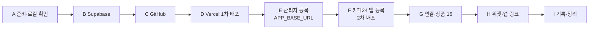

# 배포·연동 완료 가이드 — Supabase · Vercel · 카페24

이 프로토타입을 **실제 Supabase 클라우드에 붙이고, Vercel에 배포하고, 카페24 쇼핑몰 `wildmental`과 연결**하기까지 남은 작업을 순서대로 정리한 문서다.

| 문서 | 역할 |
|---|---|
| 이 문서 | 단계별 작업 방법, 확인 기준, 막힐 때 대처 |
| `docs/HUMAN_TODO.md` | 같은 작업의 짧은 체크리스트(TODO-00~30). 이 문서 없이 체크리스트만으로 진행해도 되는 조건도 적혀 있다 |
| `docs/live-test-report.md` | 실제 연동 결과를 적는 기록표 |
| [MAKJI_Cafe24_MVP_교육가이드.html](https://wild-mental.github.io/sesac-4th-corp-rfp/docs/guides/MAKJI_Cafe24_MVP_%EA%B5%90%EC%9C%A1%EA%B0%80%EC%9D%B4%EB%93%9C.html) (v3 · 발표 저장소 `wild-mental/sesac-4th-corp-rfp`의 `docs/guides/`) | 화면별 상세 설명. 이 문서의 `(가이드 7-1)` 같은 표기가 그 쪽 번호 |

## 0. 현재 상태와 남은 범위

| 구분 | 상태 |
|---|---|
| 로컬 검증 | 끝남 — `npm test` 56개 통과, `npm run build`·`npm run lint` exit 0, `node scripts/smoke.mjs` 24/24 PASS |
| MVP 체험 화면 `/` · `/predict` · `/result` | 환경변수 없이 동작 (목업 데이터) |
| 관리 화면 `/admin/cafe24`와 연동 API | **환경변수가 없으면 500** — 이 문서의 작업을 해야 동작 |
| 실제 Supabase·Vercel·카페24 | 아직 한 번도 연결하지 않음 |

표기

- 🧑 **사람** — 브라우저에서 계정·대시보드 작업
- 🔑 **비밀값** — 사람만 보고, 사람만 입력. AI 에이전트·채팅·커밋·캡처·이 문서에 넣지 않는다
- 💻 **터미널** — 비밀값이 없는 명령. 에이전트에게 맡겨도 된다
- ✅ **확인 기준** — 이 결과가 나와야 다음 단계로 간다

> 비밀값은 네 가지다: Supabase **Secret key**, 카페24 **Client Secret**, **토큰 암호화 키**, 카페24가 발급한 **토큰**.
> 여기에 계정 비밀번호(Supabase Database Password, 앱 관리자 계정 비밀번호)도 같은 수준으로 다룬다. 전체 규칙은 "2-1. 비밀값 관리".
> 에이전트에게 오류를 물어볼 때는 이 값들을 `(비밀값)`으로 지운 뒤 붙여 넣는다.
> 체크리스트(`docs/HUMAN_TODO.md`)만으로 진행해도 되는지는 HUMAN_TODO 앞부분의 조건 10개로 판단한다.

---

## 1. 전체 흐름



Vercel 주소가 먼저 있어야 카페24 앱에 URL을 등록할 수 있다. 그래서 **카페24 값 없이 1차 배포 → 주소 확보 → 카페24 등록 → 2차 배포** 순서로 간다.

---

## 2. 준비물

### 계정

| 계정 | 쓰는 곳 | 주의 |
|---|---|---|
| GitHub | 코드 저장소 — 공개 저장소 `wild-mental/wild-bread-market` (push 완료) | 공개라서 비밀값 커밋 금지 |
| Vercel | 배포 | GitHub 계정으로 로그인하면 저장소 가져오기가 쉽다 |
| Supabase | DB·관리자 로그인 | |
| 카페24 개발자센터 | 앱 등록, Client ID/Secret | 쇼핑몰 계정과 별개로 개발사(자) 등록 필요 |
| 카페24 쇼핑몰 `wildmental` **대표운영자** | 앱 설치·권한 동의 | 부운영자로 동의하면 `denied_access_denied` |

### 값 기록표 (비밀값 제외 — 팀 노트에 복사해 채운다)

```text
Supabase Project URL      : https://__________.supabase.co
Vercel Production 주소    : https://__________.vercel.app      (해시 없는 주소)
관리자 Supabase UUID      : ________-____-____-____-____________
카페24 Client ID          : ______________________
카페24 API 버전(버전관리) : 2026-09-01 인지 확인 → ☐
상품 16 원래 판매가       : 5,200원 인지 확인 → ☐
상품 16 원래 요약설명     : __________________________________
```

Secret key · Client Secret · 토큰 암호화 키는 **비밀번호 관리자**에만 둔다.

### 2-1. 비밀값 관리

**원칙**

1. 비밀값은 만든 사람이 곧바로 **비밀번호 관리자**(1Password · Bitwarden · macOS 암호 등)에 넣고, 그 밖의 곳에는 **입력만** 한다(Vercel 환경변수, 내 컴퓨터 `.env.local`).
2. AI 에이전트 대화 · 채팅 · 메일 · 이슈 · 커밋 · 캡처 · 팀 노트에 붙여 넣지 않는다. 에이전트가 요구하면 멈추고 사람이 직접 입력한다.
3. 팀원과 공유할 때는 값을 보내지 않는다. 각 서비스(GitHub · Vercel · Supabase · 카페24 개발자센터)의 **멤버 초대**로 권한을 주거나, 비밀번호 관리자의 **팀 공유 금고**를 쓴다.
4. 계정 비밀번호가 걸린 서비스는 모두 **2단계 인증**을 켠다(각 서비스 계정 보안 설정).

**목록**

| 값 | 만드는 곳 | 보관 | 넣는 곳 | 바꿔야 할 때 | 바꾼 뒤 할 일 |
|---|---|---|---|---|---|
| Supabase Database Password 🔑 | B-1 생성 화면 자동 생성 | 비밀번호 관리자 | (이 앱은 쓰지 않음) | 노출 · 담당자 변경 | Supabase 프로젝트 설정에서 재설정 |
| 앱 관리자 계정 비밀번호 🔑 | B-3 사람이 정함 | 비밀번호 관리자 | `/login` 입력만 | 노출 · 담당자 변경 | Supabase Users에서 비밀번호 재설정 |
| `SUPABASE_SECRET_KEY` 🔑 | B-1 API Keys | 비밀번호 관리자 | Vercel(Production) · `.env.local` | 노출 · 담당자 변경 · 정기 교체 | 새 키 발급 → Vercel 교체 → Redeploy → 동작 확인 → 이전 키 폐기 |
| `CAFE24_CLIENT_SECRET` 🔑 | F-4 개발자센터 인증정보 | 비밀번호 관리자 | Vercel(Production) | 노출 · 담당자 변경 | 개발자센터에서 재발급(제공되는 방법으로) → Vercel 교체 → Redeploy → G-1 [연결 상태] 확인 |
| `CAFE24_TOKEN_ENCRYPTION_KEY` 🔑 | B-4 내 터미널 | 비밀번호 관리자 | Vercel(Production) · `.env.local` | 노출 | 새 키 → Vercel 교체 → Redeploy → `cafe24_connections` 행 삭제 → G-1 재연결 (옛 키로 암호화한 토큰은 새 키로 풀 수 없다) |
| 카페24 access/refresh 토큰 🔑 | G-1 연결 시 서버가 받음 | Supabase `cafe24_connections`에 AES-256-GCM 암호문으로만 | 사람이 다루지 않음 | 앱 권한 변경 · 노출 의심 | `cafe24_connections` 행 삭제 → G-1 재연결 |
| `NEXT_PUBLIC_SUPABASE_URL` · `…PUBLISHABLE_KEY` · `CAFE24_CLIENT_ID` · `ADMIN_USER_IDS` · `APP_BASE_URL` | 각 단계 | 값 기록표 | Vercel(모든 환경 가능) | 설정 변경 | Redeploy (`NEXT_PUBLIC_`은 빌드에 박힘) |

**Vercel에 넣을 때**

- 입력 화면에서 적용 환경(Production · Preview · Development)을 고를 수 있다. 🔑 값은 **Production에만** 넣는다. Preview 배포에서 실제 쇼핑몰을 건드리지 않게 하려는 것이다.
- 입력 화면에 **Sensitive** 옵션이 있으면 켠다(저장 뒤 대시보드에서 값을 다시 볼 수 없게 하는 설정). 화면 구성은 바뀔 수 있으니 [Vercel 환경변수 문서](https://vercel.com/docs/environment-variables)로 확인한다.
- 값을 바꾼 뒤에는 반드시 Redeploy 해야 새 값이 적용된다.

**끝낼 때 · 사람이 바뀔 때**

- 실습이 끝나면 내 컴퓨터의 `.env.local`을 지운다(I-2).
- 팀원이 빠지면 각 서비스 멤버 권한을 회수하고, 그 사람이 본 🔑 값은 교체를 검토한다.
- 노출(커밋·채팅·캡처·AI 대화)이 의심되면 **삭제만으로 끝내지 않고** 위 표의 "바꾼 뒤 할 일"대로 즉시 교체한다. 공개 저장소는 push 직후 복제·수집될 수 있다.

> 확인 범위: 이 표의 보관·입력·교체 순서는 코드와 설정 구조에서 정한 것이다. 각 서비스의 키 재발급·폐기 화면, Vercel Sensitive 옵션 위치, 2단계 인증 메뉴는 이 프로토타입 작업에서 실제 계정으로 확인하지 않았다. 화면이 다르면 각 서비스 공식 문서를 따른다.

---

## A. 준비와 로컬 최종 확인

1. 🧑 쇼핑몰 관리자에서 상품 16(향기로운 허브 쌀치아바타 · `P000000Q`)의 **판매가와 요약설명**을 값 기록표에 적는다. 나중에 복원 결과와 비교하는 기준이다. (가이드 1-4)
2. 💻 프로토타입 폴더에서 로컬 검증을 다시 돌린다.

   ```bash
   cd prototype/wild-bread-market
   npm ci
   npm test && npm run build && npm run lint && node scripts/smoke.mjs
   ```

   ✅ 마지막 줄 `SMOKE: 24/24 PASS`

3. 💻 커밋되지 않은 변경이 없는지 본다. `git status --short`가 비어 있어야 한다.

---

## B. Supabase 클라우드

### B-1. 프로젝트 만들기 (가이드 4-1)

1. 🧑 [supabase.com/dashboard](https://supabase.com/dashboard) → **New project**
2. 🧑 Name `wild-bread-market`, Region **Northeast Asia (Seoul)**, Database Password는 **Generate a password** → 🔑 비밀번호 관리자에 저장 → **Create new project**
3. 🧑 **Project Settings → API Keys**에서 두 키를 확인한다.
   - Publishable key `sb_publishable_…` (공개돼도 됨)
   - 🔑 Secret key `sb_secret_…` (서버 전용) → 곧바로 비밀번호 관리자에 저장
4. 🧑 상단 **Connect** 버튼(또는 Project Settings → Data API)에서 Project URL `https://….supabase.co`를 값 기록표에 적는다.

> anon / service_role 키만 보이는 예전 방식 프로젝트라면 Publishable 자리에 anon, Secret 자리에 service_role을 넣으면 같은 코드로 동작한다.

### B-2. 테이블 만들기 (가이드 4-2)

1. 🧑 **SQL Editor → New query**
2. 🧑 `supabase/migrations/0001_cafe24_lab.sql` 전체를 붙여 넣고 **Run**
3. 🧑 입력칸을 비우고 확인 쿼리를 실행한다.

   ```sql
   select table_name
     from information_schema.tables
    where table_schema = 'public' and table_name like 'cafe24_%'
    order by 1;

   select has_table_privilege('anon', 'public.cafe24_connections', 'select') as anon_can_read;
   ```

✅ 테이블 `cafe24_change_log` · `cafe24_connections` · `cafe24_products` 3개, `anon_can_read = false`
Table Editor의 "RLS enabled, no policies" 표시는 의도한 상태다(브라우저 키로는 접근 불가, 앱 서버만 Secret key로 접근).

### B-3. 관리자 계정 (가이드 4-3)

1. 🧑 **Authentication → Users → Add user → Create new user**
2. 🧑 관리자 이메일·강한 비밀번호 입력, **Auto Confirm User** 체크 → **Create user**. 🔑 비밀번호는 비밀번호 관리자에 저장
3. 🧑 목록의 **UID**를 값 기록표에 적는다.

✅ 사용자 상태가 Confirmed

**권장(가이드에 없는 추가 보안)**: 🧑 Authentication 설정의 Sign In / Providers에서 **Allow new users to sign up**을 끈다(대시보드 버전에 따라 메뉴 이름이 조금 다를 수 있다). 이 앱은 `/login`에서 로그인만 하고 가입 화면이 없으므로 끄더라도 동작에 영향이 없다. 관리 API는 어차피 `ADMIN_USER_IDS`로 막히지만, 모르는 계정이 생기지 않게 하는 편이 안전하다.

### B-4. 토큰 암호화 키 (가이드 4-4)

🔑 **본인 터미널에서 직접** 실행하고, 결과(=로 끝나는 44글자)를 비밀번호 관리자에 저장한다. 에이전트에게 실행을 맡기지 않는다(출력이 대화에 남는다).

```bash
node -e "console.log(require('node:crypto').randomBytes(32).toString('base64'))"
```

> 이 키를 나중에 바꾸면 DB에 저장된 카페24 토큰을 풀 수 없다(`token_failed`·500). 바꿔야 하면 G-1 연결을 다시 한다.

### B-5. (선택) 로컬에서 실제 Supabase 로그인 확인

배포 전에 로그인·권한 화면만 로컬에서 보고 싶을 때.

1. 💻 `cp .env.example .env.local`
2. 🔑 `.env.local`에 Supabase 값 3개, 암호화 키, `APP_BASE_URL=http://localhost:3000`, `ADMIN_USER_IDS=pending`을 넣는다. 카페24 값은 비워 둔다.
3. 💻 `npm run dev` → 🧑 `http://localhost:3000/login`에서 B-3 계정으로 로그인
4. 🧑 "관리자 권한이 없습니다" 화면의 UUID를 `ADMIN_USER_IDS`에 넣고 dev 서버를 재시작하면 관리 화면이 열린다.

> 카페24 Redirect URI는 https 주소만 등록할 수 있어서 **카페24 연결은 로컬에서 할 수 없다.** 연결은 Vercel 주소에서 한다.
> `.env.local`은 `.gitignore`의 `.env*` 규칙으로 커밋되지 않는다.

---

## C. GitHub 저장소 (가이드 5-1)

이 폴더는 독립 git 저장소이고, **공개 저장소 [wild-mental/wild-bread-market](https://github.com/wild-mental/wild-bread-market)에 이미 push되어 있다**(상위 `sesac-4th-corp-rfp` 저장소는 이 폴더를 무시한다). 새로 만들 필요는 없다.

공개 저장소라 누구나 코드를 볼 수 있다. 그래서 push할 때마다 아래를 지킨다.

1. 💻 push 전에 비밀값 파일이 추적되지 않는지 확인한다.

   ```bash
   git ls-files | grep -E '(^|/)\.env'
   ```

   ✅ 결과가 `.env.example` 한 줄뿐 (`.env.local`은 `.gitignore`의 `.env*` 규칙으로 제외)

2. 🔑 비밀값은 Vercel Environment Variables에만 넣는다. 코드·문서·커밋 메시지·이슈에 붙여 넣지 않는다.
3. 💻 다른 GitHub 계정·저장소로 옮겨 배포하려면 fork 하거나 원격을 바꿔 push한다.

   ```bash
   git remote set-url origin https://github.com/계정이름/wild-bread-market.git
   git push -u origin main
   ```

✅ GitHub에 `src`, `supabase`, `tests`, `public/widgets`, `scripts` 폴더가 보이고 `.env.local`은 없다.

> 비밀값이 든 파일을 실수로 올렸다면 삭제 커밋으로 끝내지 말고 해당 키를 Supabase·카페24에서 **즉시 재발급**한 뒤 Vercel 값을 바꾼다. 공개 저장소는 push 직후 복제·수집될 수 있다.

---

## D. Vercel 1차 배포 (가이드 5-2)

1. 🧑 [vercel.com/new](https://vercel.com/new) → `wild-bread-market` 저장소 **Import**
2. 🧑 Framework Preset **Next.js**, Root Directory **`./`** 확인
3. 🧑 (권장) 프로젝트 생성 후 **Settings → Build and Deployment → Node.js Version**을 로컬과 같은 **24.x**로 맞춘다.
4. 🔑 **Environment Variables**에 아래 5개를 넣는다. 🔑 표시 값은 적용 환경을 **Production만** 고르고, Sensitive 옵션이 보이면 켠다(2-1).

   | 이름 | 값 |
   |---|---|
   | `NEXT_PUBLIC_SUPABASE_URL` | B-1 Project URL |
   | `NEXT_PUBLIC_SUPABASE_PUBLISHABLE_KEY` | B-1 Publishable key |
   | `SUPABASE_SECRET_KEY` 🔑 | B-1 Secret key |
   | `CAFE24_TOKEN_ENCRYPTION_KEY` 🔑 | B-4에서 만든 44글자 |
   | `ADMIN_USER_IDS` | `pending` (E에서 진짜 UUID로 바꾼다) |

5. 🧑 **Deploy** → 끝나면 프로젝트 **Domains**의 Production 주소를 값 기록표에 적는다.

✅ `https://(내 앱 주소)/`, `/predict`, `/result`가 열리고 지수 값이 102.4 · 98.7 · 105.1

> **해시가 들어간 배포별 주소**(`wild-bread-market-a1b2c3-계정.vercel.app`)는 배포마다 바뀐다. 이후 모든 곳에 **Domains의 Production 주소**만 쓴다.
> `NEXT_PUBLIC_…` 두 값은 **빌드할 때 코드에 박힌다**(`src/proxy.ts`). 이 값을 바꾸면 반드시 Redeploy 한다.
> Vercel **Deployment Protection**이 Production 도메인까지 막으면 카페24 위젯·OAuth 콜백이 로그인 화면에 걸린다. Production 주소가 로그인 없이 열리는지 시크릿 창으로 확인한다.

---

## E. 관리자 UUID와 앱 주소 등록 (가이드 5-3)

1. 🧑 `https://(내 앱 주소)/login`에서 B-3 계정으로 로그인
2. 🧑 자동으로 이동한 "관리자 권한이 없습니다" 화면의 UUID를 복사한다(B-3의 UID와 같아야 한다).
3. 🧑 Vercel **Settings → Environment Variables**
   - `ADMIN_USER_IDS` = 복사한 UUID (여러 명이면 쉼표로 구분)
   - `APP_BASE_URL` = `https://(내 앱 주소)` 추가 (끝에 `/` 없이)
4. 🧑 **Deployments → 맨 위 배포 ⋯ → Redeploy** (환경변수는 새 배포부터 적용)
5. 🧑 `/admin/cafe24` 새로고침

✅ 제목 "카페24 연동 관리" 아래 `쇼핑몰 wildmental · shop_no 1 · 상품 16 (P000000Q) · 분류 81 · display_group 1` 한 줄과 1~4 구역이 보인다.

| 증상 | 해결 |
|---|---|
| 로그인 후 500 | Vercel → Logs에서 `환경변수 ○○이(가) 비어 있습니다.`를 찾아 채우고 Redeploy |
| 계속 권한 없음 화면 | UUID 앞뒤 공백·쉼표 확인, Redeploy 했는지 확인 |

---

## F. 카페24 개발자센터 앱 등록과 2차 배포

### F-1. 개발사(자) 등록 (가이드 6-1)

🧑 [developers.cafe24.com](https://developers.cafe24.com) 로그인 → 처음이면 개발사(자) 등록 약관 동의 → 정보 입력 → 등록 완료. 개발자 어드민 왼쪽 메뉴에 **Apps**가 보이면 된다.
개발자 계정이 `wildmental`이 아니어도 괜찮다. 설치 동의만 G-1에서 `wildmental` 대표운영자로 한다.

### F-2. 앱 만들기 (가이드 6-2)

🧑 **Apps → App 관리 → [ADD PRODUCT]**

| 항목 | 입력값 |
|---|---|
| App 유형 | Web Application (저장 후 변경 불가) |
| 관리 상품명 | `MAKJI LAB` (쇼핑몰 관리자 로그에 변경 주체로 표시) |
| App URL | `https://(내 앱 주소)/admin/cafe24` |
| Redirect URI(s) | `https://(내 앱 주소)/api/cafe24/oauth/callback` |

> Redirect URI는 한 글자도 달라서는 안 된다. 서버는 `APP_BASE_URL` + `/api/cafe24/oauth/callback`을 보낸다. http/https, 도메인, 경로, 끝의 `/`가 다르면 `invalid_request`.

### F-3. 권한과 API 버전 (가이드 6-3)

🧑 **Apps → App 관리 → MAKJI LAB → STEP 1. 개발정보 관리**

| 권한관리 | 설정 | 코드의 scope |
|---|---|---|
| 앱 (Application) | 읽기 + 쓰기 | `mall.read_application`, `mall.write_application` |
| 상품 (Product) | 읽기 + 쓰기 | `mall.read_product`, `mall.write_product` |

- 필요 없는 권한이 기본 체크돼 있으면 해제한다. 해제할 수 없어서 G-1에서 `denied_invalid_scope`가 나면 그 scope를 `src/lib/cafe24/lab-config.ts`의 `CAFE24_SCOPES`에 추가하고 커밋·push·재배포한다.
- 같은 화면 **인증정보 → 버전관리** 값이 `2026-09-01`이 아니면 `lab-config.ts`의 `CAFE24_API_VERSION`을 그 값으로 바꾸고 커밋·push·재배포한다.
- 연결한 뒤 권한을 바꾸면 G-1 연결을 다시 해야 새 권한이 적용된다.

### F-4. Client ID/Secret 등록 · 2차 배포 (가이드 6-4)

1. 🔑 **STEP 1. 개발정보 관리 → 인증정보**의 Client ID와 Client Secret Key를 확인하고, Client Secret은 비밀번호 관리자에 저장한다.
2. 🔑 Vercel Environment Variables에 `CAFE24_CLIENT_ID`, `CAFE24_CLIENT_SECRET` 추가 (Client Secret은 Production만 · Sensitive)
3. 🧑 **Redeploy**
4. 🧑 `/admin/cafe24` → **1. 연결 → [연결 상태]**

✅ 결과 `{"mallId": "wildmental", "connected": false}` (연결 전이라 false가 정상)

이 시점의 Vercel 환경변수는 8개다.

| 이름 | 값 모양 | 비밀 | 입력 단계 | 바꾸면 |
|---|---|---|---|---|
| `NEXT_PUBLIC_SUPABASE_URL` | `https://xxxx.supabase.co` | | D | Redeploy |
| `NEXT_PUBLIC_SUPABASE_PUBLISHABLE_KEY` | `sb_publishable_…` | | D | Redeploy |
| `SUPABASE_SECRET_KEY` | `sb_secret_…` | 🔑 | D | Redeploy |
| `CAFE24_TOKEN_ENCRYPTION_KEY` | `=`로 끝나는 44글자 | 🔑 | D | Redeploy + G-1 재연결 |
| `ADMIN_USER_IDS` | UUID (쉼표 구분) | | D → E | Redeploy |
| `APP_BASE_URL` | `https://(내 앱 주소)` | | E | Redeploy + 카페24 URL 2개도 같이 수정 |
| `CAFE24_CLIENT_ID` | 영문·숫자 | | F-4 | Redeploy |
| `CAFE24_CLIENT_SECRET` | 영문·숫자 | 🔑 | F-4 | Redeploy |

---

## G. 카페24 연결과 상품 16 실연동

### G-1. 앱 설치(테스트 실행)와 연결 (가이드 7-1)

1. 🧑 개발자 어드민 **MAKJI LAB → STEP 01. 개발정보 관리 → [테스트 실행]** → 쇼핑몰 ID `wildmental` → **[실행]**
2. 🧑 쇼핑몰 관리자 로그인 화면에서 **wildmental 대표운영자**로 로그인 → 앱 설치 동의
3. 🧑 앱 화면이 카페24 안에 열리거나 로그인 화면이 보이면 새 탭에서 `https://(내 앱 주소)/admin/cafe24`를 직접 연다.
4. 🧑 **1. 연결 → [카페24 연결하기]를 한 번만** 누르고 권한 동의
5. 🧑 돌아온 화면 맨 위 "연결 결과"를 확인하고 **[연결 상태]**

✅ 연결 결과 `connected`, [연결 상태]가 `"connected": true`와 scopes 4개 (시각은 UTC)

> [카페24 연결하기]를 연달아 누르지 않는다. 카페24는 **토큰 요청을 2시간에 최대 15회**로 제한하고 넘으면 앱을 일시 차단할 수 있다. 인증 코드는 1분 안에 교환된다.

### G-2 ~ G-6. 상품 16 조회·수정·복원 (가이드 7-2 ~ 7-6)

모두 `/admin/cafe24`의 버튼으로 한다. 결과는 화면 아래 "결과" 칸에 JSON으로 나온다.

| 단계 | 버튼 | ✅ 확인 기준 |
|---|---|---|
| G-2 조회 | 2. 상품 → **[상품 조회]** | `product.product_name` 향기로운 허브 쌀치아바타 · `current.price` 5200 · `inCategory` true · `state` null |
| G-3 기준값 | **[기준값 저장]** 두 번 | 첫 번째 `"created": true`, 두 번째 `"created": false`. `state.baseline`이 A-1 기록과 같음 |
| G-4 up 적용 | 3. 지수 반영 → `up · 통밀 브레드 지수 102.4 ▲1.2%`, 할인 **체크 해제** → **[미리보기]** → **[적용]** 두 번 | 미리보기 `changes`에 요약설명만 · 적용 `"result": "applied"` → `"already"` · 쇼핑몰 관리자 상품 요약설명이 `[MAKJI 브레드마켓] 통밀 브레드 지수 102.4 ▲1.2% UP …` |
| G-5 down+할인 | `down · 101.9 ▼0.5%`, **하락일 5% 할인 규칙 적용** 체크 → [미리보기] → [적용] | `after.price` 4940 · 시크릿 창 상품 16 상세 판매가 **4,940원** · 다시 [적용]하면 `already` (더 내려가지 않음) |
| G-6 복원 | **[기준값으로 복원]** → [상품 조회] | `"result": "applied"` · `current.price` 5200 · 상품 페이지 5,200원 |

- 상품 페이지에 요약설명이 안 보이는 것은 정상이다(현재 스킨의 상세 기본 정보에 요약설명 항목이 없음). 요약설명은 관리자 화면·API로 확인한다.
- G-5에서 장바구니·주문까지만 보고 **결제하지 않는다.**
- (선택) 충돌 확인: down+할인 적용 → 쇼핑몰 관리자에서 판매가를 4,500으로 직접 저장 → [기준값으로 복원] → HTTP 409 `EDITED_ELSEWHERE`(앱이 사람이 바꾼 값을 덮어쓰지 않음). 관리자에서 5,200·원래 요약설명으로 되돌린 뒤 복원하면 `already`.

---

## H. 상품 상세 위젯과 앱 링크

### H-1. 설치 전 확인 (가이드 8-2)

💻 비밀값이 없는 명령이다.

```bash
APP=https://(내 앱 주소)
curl -i -H "Origin: https://wildmental.cafe24.com" "$APP/api/public/bread-widget?product_no=16"
curl -s "$APP/api/public/bread-widget?product_no=17"
curl -sI "$APP/widgets/makji-bread.js" | head -3
```

✅ ① `200`, `access-control-allow-origin: https://wildmental.cafe24.com`, JSON `productNo 16 · 102.4 · UP` ② `{"error":"NOT_REGISTERED"}` ③ `200` · `application/javascript`

### H-2. Scripttags로 설치 (가이드 8-3)

🧑 4. 상품 상세 위젯 → **[설치 확인]**(`"installed": []`) → **[위젯 설치]**(`"result": "installed"`) → 한 번 더(`"already"`)

> 스크립트 등록 API는 호출 한도가 작다. `CAFE24_429`가 나면 메시지의 초만큼 기다린 뒤 한 번만 누른다.

### H-3. 손님 화면 확인 (가이드 8-4)

1. 🧑 시크릿 창에서 [상품 16 상세](https://wildmental.cafe24.com/product/%ED%96%A5%EA%B8%B0%EB%A1%9C%EC%9A%B4-%ED%97%88%EB%B8%8C-%EC%8C%80%EC%B9%98%EC%95%84%EB%B0%94%ED%83%80/16/category/81/display/1/)를 연다(설치 직후면 1분 뒤 새로고침).
2. ✅ 오른쪽 아래 카드: `MAKJI 브레드마켓 · 실습 데이터` / `통밀 브레드 지수` / `102.4 ▲1.2%` / `[오늘의 UP/DOWN 예측하기 →]`
3. ✅ 버튼을 누르면 앱 랜딩이 새 탭에 열리고 주소에 `utm_source=cafe24`
4. ✅ 개발자 도구 기기 모드 390px에서 카드가 구매 버튼을 가리지 않음
5. ✅ 다른 상품 상세에서는 카드가 뜨지 않음

### H-4. 앱 → 자사몰 링크 (가이드 9-1)

🧑 `https://(내 앱 주소)/`의 통밀 브레드 지수 카드 → **오늘의 브레드 보러 가기 (자사몰 상품 16) →**
✅ 새 탭에 향기로운 허브 쌀치아바타 상세(5,200원)가 열리고 주소에 `utm_medium=index_card`

---

## I. 기록과 정리

### I-1. 검증 기록 (가이드 10-2)

🧑 `docs/live-test-report.md`의 표를 채운다. 실행하지 못한 항목은 통과로 적지 않고 "미실행"으로 적는다.
캡처 3장(관리 화면 적용 결과 · 쇼핑몰 관리자 판매가 4,940 · 모바일 위젯)에 Client Secret·토큰이 보이지 않게 한다.

### I-2. 실습 종료 정리 (가이드 10-3) — 연동을 계속 운영할 거라면 3·4는 하지 않는다

1. 🧑 [기준값으로 복원] → [상품 조회]로 `current.price` 5200
2. 🧑 [위젯 삭제](`"result": "removed"`) → [설치 확인]으로 빈 목록
3. 🧑 쇼핑몰 관리자 **앱 → 마이앱**에서 MAKJI LAB 테스트 앱 삭제 (카페24는 테스트가 끝난 앱 삭제를 안내하고, 개발 중 앱은 최대 5개까지만 설치된다)
4. 🧑 Supabase SQL Editor에서 토큰 삭제 (기준값·이력은 남김)

   ```sql
   delete from public.cafe24_connections where mall_id = 'wildmental';
   ```

5. 💻 내 컴퓨터의 `.env.local`을 지운다(B-5를 했을 때). 연동을 계속 운영하더라도 로컬 사본은 필요할 때만 만든다.
6. 🧑 실습용으로 초대한 팀원 권한을 회수한다(2-1).

---

## 3. 운영 전에 추가로 챙길 것

프로토타입 검증 범위 밖이라 **실제 환경에서 확인하거나 결정해야 하는 항목**이다.

| # | 항목 | 할 일 |
|---|---|---|
| 1 | 토큰 수명 | access 2시간, refresh 14일(한 번 쓰면 폐기). 관리 API를 쓰면 서버가 DB 잠금으로 자동 갱신하지만, **14일 넘게 한 번도 쓰지 않으면** `CAFE24_NOT_CONNECTED (REFRESH_EXPIRED)` → G-1 재연결 |
| 2 | 쇼핑몰 주소가 바뀌거나 커스텀 도메인을 쓸 때 | 위젯 공개 API의 CORS 허용 목록은 `lab-config.ts`의 `storefrontOrigins`(현재 `https://wildmental.cafe24.com` 하나)다. 손님이 보는 도메인을 추가하고 재배포. 추가하지 않으면 위젯이 조용히 안 뜬다 |
| 3 | 앱 주소를 바꿀 때 | `APP_BASE_URL`, 카페24 App URL·Redirect URI, 설치된 위젯(`src`에 옛 주소)이 모두 묶여 있다. 위젯 삭제 → 값 3곳 수정 → Redeploy → 재연결 → 위젯 재설치 순서 |
| 4 | 카페24 앱 운영 형태 | 지금 절차는 개발자센터의 **테스트 실행** 설치다. 테스트 앱을 장기 운영해도 되는지, 정식 운영 시 필요한 앱 검수·공개 절차가 있는지 카페24 개발자센터 문서로 확인한다 |
| 5 | Supabase 가입 차단 | B-3 권장 설정(Allow new users to sign up 끄기) 적용 여부 확인 |
| 6 | Vercel 배포 보호 | Production 도메인이 로그인 없이 열리는지 확인(위젯·OAuth 콜백이 여기에 의존) |
| 7 | 비밀값 노출 대응 · 교체 | GitHub·채팅·캡처·AI 대화에 🔑 값이 올라갔다면 삭제만으로 끝내지 말고 2-1 표의 "바꾼 뒤 할 일"대로 교체. 계정 2단계 인증, 멤버 권한, Vercel 적용 환경·Sensitive 설정도 2-1대로 점검 |
| 8 | 목업 규칙 확정 | 회차 마감 시각(목업 09:00 KST), 보합 판정(목업: 무효) — `docs/DECISION_LOG.md` MINOR-02·07, HUMAN_TODO TODO-25·26 |
| 9 | Supabase 무료 플랜 | 무료 프로젝트는 일정 기간 활동이 없으면 일시 정지될 수 있다. 시연 직전 대시보드에서 프로젝트 상태 확인 |

---

## 4. 막히면

관리 화면 맨 위 "연결 결과" 또는 결과 칸의 `error.code`로 찾는다. 전체 표는 가이드 11-2 ~ 11-4.

| 값 | 원인 | 해결 |
|---|---|---|
| `login_required` | 카페24에서 돌아왔을 때 앱 로그인 세션 없음 | 같은 브라우저에서 `/login` 후 다시 연결 |
| `state_mismatch` | 5분 초과, 다른 탭·다른 관리자로 시작, 쿠키 차단 | 같은 탭에서 한 번만 다시 연결 |
| `denied_access_denied` | 부운영자 등으로 동의 | wildmental **대표운영자**로 다시 |
| `denied_invalid_scope` | 권한관리 체크와 `CAFE24_SCOPES` 불일치 | F-3 표와 코드 맞추고 재배포 |
| `denied_invalid_request` | Client ID·Redirect URI 불일치 | `CAFE24_CLIENT_ID`, F-2 Redirect URI = `APP_BASE_URL`/api/cafe24/oauth/callback |
| `token_failed` | 코드 만료, Client Secret 오타, DB 저장 실패 | Vercel Logs의 `[cafe24] token exchange failed:` 뒤 값 (`invalid_client` = Secret 오타, `invalid_grant` = 코드 만료, `DB_SAVE_FAILED` = Supabase) |
| `BAD_ORIGIN` 403 | 배포별 주소로 접속 | Production 주소로 접속하거나 `APP_BASE_URL` 수정 후 Redeploy |
| `BASELINE_REQUIRED` 409 | 기준값 저장 전에 적용 | G-3 |
| `NOT_IN_CATEGORY` / `PRODUCT_MISMATCH` 409 | 상품 16의 분류·상품코드가 바뀜 | 쇼핑몰 관리자에서 상품 16 확인 |
| `CAFE24_403` 502 | scope 없음, 앱 삭제됨 | F-3 → G-1 재연결 |
| `CAFE24_422` 502 | 가격 계산 기준이 세금 제외 방식 등 | 가이드 7-5 참고(`price_excluding_tax`) |
| `CAFE24_429` 502 | 호출 한도 초과 | 메시지의 초만큼 기다리고 한 번만 |
| `EDITED_ELSEWHERE` 409 | 마지막 적용 뒤 누군가 직접 수정 | 쇼핑몰 관리자에서 값 정리 후 복원 |
| `INTERNAL` 500 | 환경변수 누락, DB 오류 | Vercel Logs에서 `환경변수 ○○이(가) 비어 있습니다` 또는 `[cafe24]` 줄 |
| 공개 API `UNAVAILABLE` 503 | Supabase 값 또는 B-2 테이블 문제 | Vercel 환경변수·SQL 실행 확인 |
| 위젯이 안 보임 | 설치·로드·CORS·상품번호 중 하나 | ① `curl -sI $APP/widgets/makji-bread.js` 200 ② [설치 확인]에 1개 ③ 상품 페이지 소스에 `makji-bread.js` ④ Network의 `bread-widget` 200 (CORS 오류면 "3. 운영 전에 추가로 챙길 것" 2번) ⑤ 같은 탭에서 × 로 닫았으면 새 시크릿 창 |

에이전트에게 물어볼 때 쓰는 틀 (비밀값 제거 후):

```text
카페24 Admin API 연동 오류를 같이 찾아줘. 코드는 prototype/wild-bread-market 그대로다.
실패 단계: [G-1 연결 / G-2 조회 / G-4 적용 / H-2 위젯 설치 중 하나]
화면의 연결 결과 또는 error.code: [붙여넣기]
Vercel Logs의 [cafe24] 줄: [토큰·code·Secret 제거 후 붙여넣기]
최근 바꾼 설정: [설명]
추정과 확인된 사실을 구분하고 한 번에 한 원인씩 확인 방법을 알려줘. state 검사를 끄거나 토큰을 브라우저로 옮기는 해결은 제안하지 마.
```

---

## 5. 이 가이드 이후 — 프로토타입을 실제 MVP로 키울 때 남은 개발

이 문서의 작업을 모두 끝내도 **MVP 체험 화면은 목업**이다. 발표자료의 MVP 흐름까지 가려면 아래 개발이 따로 필요하다(이번 범위 아님).

| 영역 | 지금 | 필요한 작업 |
|---|---|---|
| 지수 데이터 | `src/lib/mvp/mock-data.ts` 고정값 | KOSPI·원/달러 환율·금 시세를 영업일 1일 1회 수집하는 스케줄러, 원본값 → 3종 브레드 지수 변환, 휴장·미공시 처리 |
| 참여자 계정 | 없음 (관리자 로그인만) | 일반 사용자 가입·로그인, 개인정보·약관 동의 |
| 예측 저장 | 브라우저 localStorage | DB 테이블과 RLS, **서버 시각 기준 마감 차단**(현재는 화면에서만 막음) |
| 정답 판정·정확도 | 순수 함수만 있음 (`src/lib/mvp/challenge.ts`) | 확정값 공시 후 배치 판정, 주간 정확도 집계. 판정 함수는 그대로 재사용 가능 |
| 랭킹·리워드·공유 | 없음 | 주간 랭킹(U07), 최소 참여 기준, 7일 구독권 발급, 랭킹 카드 공유(U10) |
| 관리자 기능 | 카페24 연동 관리만 | 운영 현황·이벤트 설정·데이터 관리·판정 검증 화면(A01~A05) |
| 카페24 상품 | 상품 16 하나 (`LAB.product`) | 크루아상·골든 브레드 지수 상품이 확정되면 `LAB.product`를 배열로 바꾸고 각 라우트가 상품번호를 허용 목록과 대조 |
| 위젯 값 | 관리자가 고른 up/down 시나리오 | 실제 지수 값과 연결 |

---

## 6. 완료 체크

- [ ] A 상품 16 원래 값 기록, 로컬 `SMOKE: 24/24 PASS`
- [ ] B Supabase 테이블 3개 · `anon_can_read = false` · 관리자 계정(비밀번호 보관) · Secret key·암호화 키 보관
- [x] C GitHub 공개 저장소 `wild-mental/wild-bread-market`에 push, `.env.local` 없음
- [ ] D Vercel 1차 배포, Production 주소에서 `/` · `/predict` · `/result` 확인
- [ ] E `/admin/cafe24` 관리 화면 열림
- [ ] F 카페24 앱 URL 2개 · 권한 4종 · API 버전 · Client 값, `connected: false` 응답
- [ ] G `connected: true` · 조회 · 기준값 · up `applied→already` · 판매가 4,940원 · 복원 5,200원
- [ ] H 공개 API·JS 확인 · 위젯 설치 · PC/모바일 카드 · 앱 ↔ 자사몰 링크
- [ ] I `docs/live-test-report.md` 작성 · (실습만 할 경우) 정리
- [ ] 2-1 비밀값: 비밀번호 관리자 보관 · Vercel Production만 · 2단계 인증 · `.env.local` 정리
- [ ] 3장 운영 전 항목 검토
